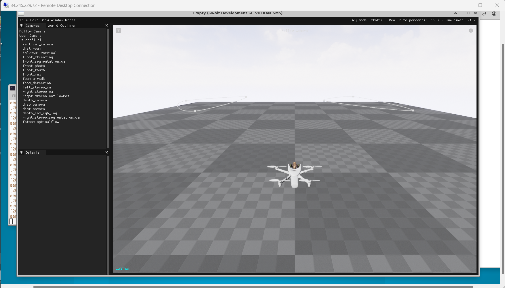
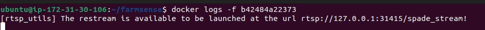
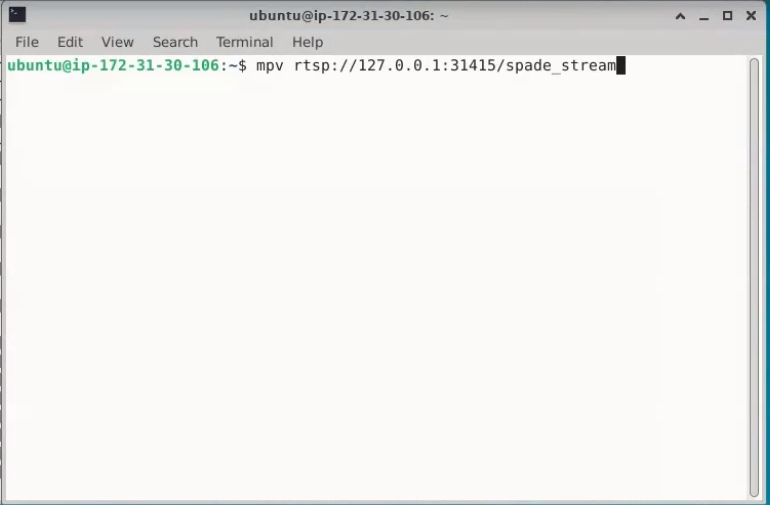

<!--
  ~ Copyright (c) 2024 FORCERA, LDA
  ~ 
  ~ This program and the accompanying materials are made available under the
  ~ terms of the Eclipse Public License 2.0 which is available at
  ~ http://www.eclipse.org/legal/epl-2.0.
  ~ 
  ~ SPDX-License-Identifier: EPL-2.0
-->

# FARMSENSE

The drone and stream sides of the SPADE project was developed and tested using the [Parrot Sphinx](https://developer.parrot.com/docs/sphinx/index.html) drone simulation tool in an Ubuntu 22.04.4 LTS environment. In order to configure the simulator, we recommend following the installation procedure available at the Parrot website. Once installed and configured, in one terminal run the command
```
sphinx "/opt/parrot-sphinx/usr/share/sphinx/drones/anafi_ai.drone"::firmware="https://firmware.parrot.com/Versions/anafi2/pc/%23latest/images/anafi2-pc.ext2.zip"
```
to launch the core simulator. Then, in another terminal
```
parrot-ue4-empty
```
to connect to the Unreal Engine application. In case any doubts emerge, access the [Quick start](https://developer.parrot.com/docs/sphinx/quickstart.html) section of the getting started guide.

**NOTE**: When the drone appears on the application environment, wait some seconds before launching the containers. This action avoids some connection issues that might appear when the simulator is not completely configured. 

An example of the sphinx application running properly is the following:


#### Requirements
A high-performance machine is recommended to work with the simulator and all the supporting software. The simulator is recommended to run on a 12-core CPU with 16GB of RAM and an up-to-date graphics card above RTX 2070. Machines with 16GB of RAM and 8 cores presented issues when running the simulator and the containers from the UAV side of data collection. Smaller RAM and core combinations didn't even manage to launch the simulator. 
All the tests of the FARMSENSE UAV front were performed on an Ubuntu 22.04.4 LTS OS machine with 32GB of RAM, 8 cores and an NVIDIA TU104GL GPU.

The following commands are also required to guarantee the correct installation of the gstreamer python repository:
```
sudo apt-get install gir1.2-gtk-3.0    gstreamer1.0-tools     gstreamer1.0-plugins-base     gstreamer1.0-plugins-good     gstreamer1.0-plugins-bad     gstreamer1.0-plugins-ugly     gstreamer1.0-libav     gstreamer1.0-gtk3     gstreamer1.0-pulseaudio     python3-gst-1.0     gir1.2-gst-rtsp-server-1.0
sudo apt-get install mosquitto
sudo apt-get install mosquitto-clients
pip install pycairo PyGObject
```

### Spade Framework
The framework container runs all the functionalities related to UAV data and video acquisition, frame overwriting with the telemetry data and the publishing of the pre-processed frames to the Redis database 'frame-buffer' channel.

#### Environment Variables
The script relies on the following environment variables specified under `Framework environment variables` in the `.env` file:

- **`FRAMEWORK_LOCAL_MQTT_BROKER`**: The MQTT broker address where data is published;
- **`FRAMEWORK_MQTT_PORT`**: Port number used to connect to the MQTT broker;
- **`FRAMEWORK_DRONE_MQTT_TOPIC`**: Topic from which the MQTT client subscribes and publishes the drone telemetry data;
- **`FRAMEWORK_DRONE_CAMERA_TOPIC`**: Topic from which the MQTT client subscribes and publishes the camera information data;
- **`FRAMEWORK_DRONE_IP`**: The IP of the drone to which the user would like to connect;
- **`BEHAVIOR_GRAZE_BINARY_TRAIN_SET`**: Labeled data used to compute the kNN algorithm for the grazing classification task;
- **`BEHAVIOR_WALK_BINARY_TRAIN_SET`**: Labeled data used to compute the kNN algorithm for the walking classification task;
- **`FRAMEWORK_TELEMETRY_SAMPLING_TIME`**: The sampling time, in seconds, for the publishing of data on the MQTT topics.

#### Free-flight mode
In most of the cases, a pre-defined route for the drone will not be the intended use case. 
To activate free-flight mode, meaning the drone will be left for the user to control, simply change the argument `free_flight` of the `module_init` constructor in the `spade_drone_module.py` script to 

```plaintext
mission_obj = module_utils.module_init(drone_data(drone_ip), 554, free_flight=True)
```
and rebuild the container.

### RTSP stream
The RTSP server that consumes from the Redis buffer the altered frames and streams them to the new URL, which can be found in the logs of the container.

You may then access the URL using any RTSP client.

#### Example: accessing the stream with mpv


## Contributing
Pull requests are welcome. For major changes, please open an issue first to discuss what you would like to change.

Please make sure to update tests as appropriate.

## License

[Eclipse Public License 2.0](https://www.eclipse.org/legal/epl-2.0/)
